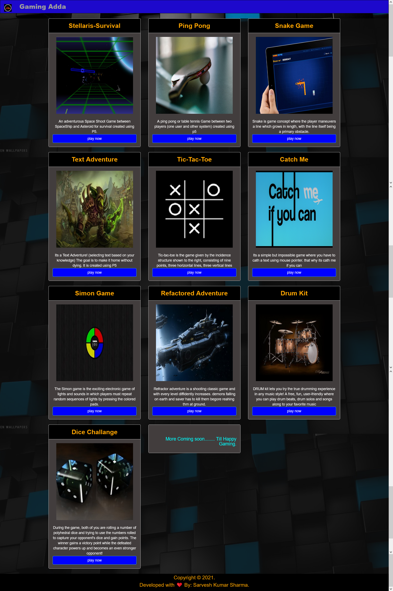

# Games Adda
This repo Contain some small Fun games using Front end technologies (HTML, CSS, JavaScript, and Bootstrap ) performed while learning frontend technologies. 

[play here](https://shsarv.github.io/Games-Adda/)

 

### list of games

* Stellaris Survival
* Snake Eat Game
* Ping Pong
* Simon
* Refractored Adventure
* Tic-toc-toe
* Catch me if you can
* Text Adventure
* Dice Challange
* Drum Kit

### Technologies used

<code></code>
<code></code>
<code></code>
<code></code>

### Created by 

Sarvesh Kumar Sharma

### License

**Apache-2.0 License**
